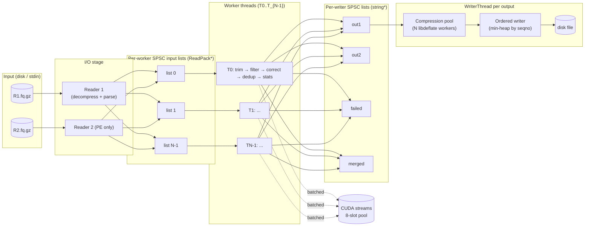
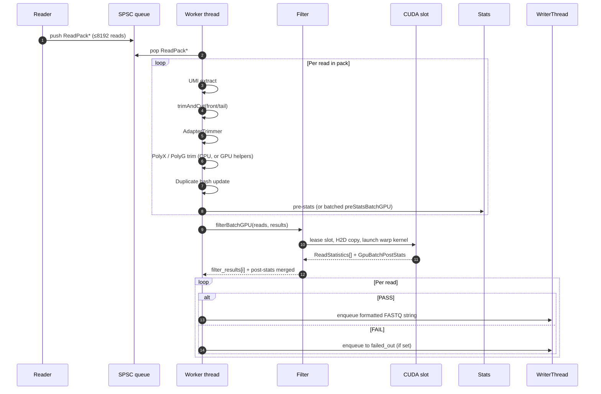
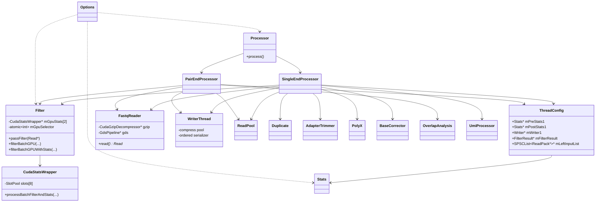

# fastp (GPU-accelerated fork) — Architecture

**Last Updated:** April 25, 2026
**fastp Version:** 1.3.3-d0bromir (rebased on upstream 1.3.3)
**Status:** Production Ready
**Total Code:** ~14,620 lines of C++/CUDA

This document describes the end‑to‑end architecture of this fork of `fastp`.
It covers the CPU pipeline (inherited from upstream fastp), the GPU
acceleration layers added in this fork, the threading and memory model, and
the build‑time capability matrix.

The previous revision of this document (focused only on the warp kernel and
GPU memory layout) is preserved as `ARCHITECTURE.md.bak` next to this file.

---

## 1. What this fork is

This is a **GPU‑accelerated fork of `fastp`** — an end‑to‑end FASTQ
preprocessor that performs:

- Per‑read and per‑cycle quality / base statistics (pre‑filter and post‑filter).
- Adapter trimming (auto‑detected or user‑supplied; PE overlap‑based).
- Quality / length / N‑content / low‑complexity filtering.
- PolyG and PolyX tail trimming.
- UMI extraction.
- Duplication estimation and optional deduplication.
- Paired‑end overlap analysis, base correction, and optional merging.
- HTML and JSON reporting.

The fork preserves the **producer / consumer multi‑threaded pipeline** of
upstream fastp and adds **three optional GPU layers**, each with a CPU
fallback that is selected automatically at runtime:

1. **GPU stats + filter kernels** — `cuda_stats.cu`, available whenever the
   binary is built with `WITH_CUDA=1`.
2. **GPU gzip / BGZF decompression** via NVIDIA nvCOMP — `cuda_gzip.cu`,
   gated on `WITH_NVCOMP=1`.
3. **GPU‑Direct Storage (GDS)** end‑to‑end NVMe → GPU pipeline —
   `gds_pipeline.cu`, gated on `WITH_GDS=1` and the `--use_gds` CLI flag.

When CUDA is not present (or fails to initialise) the binary still runs
identically to upstream fastp: a no‑op stub (`cuda_stats_stub.cpp`) is linked
in place of the CUDA wrapper.

---

## 2. High‑level component map

```mermaid
flowchart TB
    subgraph CLI["main.cpp — CLI / argument parsing"]
        ARGS[cmdline::parser]
        OPTS[Options]
    end

    ARGS --> OPTS --> EVAL[Evaluator<br/>auto-detect adapter,<br/>read length, phred,<br/>duplication]
    EVAL --> PROC{Processor<br/>(facade)}

    PROC -- single-end --> SE[SingleEndProcessor]
    PROC -- paired-end --> PE[PairEndProcessor]

    subgraph PIPELINE["Per-thread pipeline (SE & PE share the model)"]
        direction LR
        RD["Reader thread(s)<br/>FastqReader"] -->|ReadPack*| Q1[(SPSC queue<br/>per worker)]
        Q1 --> WK["Worker threads<br/>processSingleEnd /<br/>processPairEnd"]
        WK -->|string* chunk| Q2[(SPSC queue<br/>per writer)]
        Q2 --> WR["WriterThread(s)<br/>compress pool +<br/>ordered serializer"]
    end

    SE --> PIPELINE
    PE --> PIPELINE

    WK -.uses.-> FLT[Filter]
    WK -.uses.-> ADAPT[AdapterTrimmer]
    WK -.uses.-> POLY[PolyX]
    WK -.uses.-> CORR[BaseCorrector]
    WK -.uses.-> UMI[UmiProcessor]
    WK -.uses.-> DUP[Duplicate]
    WK -.uses.-> OV[OverlapAnalysis<br/>(PE only)]
    WK -.uses.-> ST[Stats<br/>pre + post]

    FLT --> GW[CudaStatsWrapper × N GPUs<br/>round-robin selector]
    GW --> KSTATS[(cuda_stats.cu<br/>per-read warp kernels<br/>+ post-stats kernel)]

    RD --> RPP[ReadPool<br/>object recycling]
    RD -.optional.-> GZIP[CudaGzipDecompressor<br/>nvCOMP BGZF / gzip]
    RD -.optional.-> GDS[GdsPipeline<br/>cuFile NVMe→GPU<br/>end-to-end]

    WR --> RPT[HtmlReporter / JsonReporter]
```

### Module roles

| File(s) | Role |
|---|---|
| [src/main.cpp](../src/main.cpp) | CLI parsing, evaluator dispatch, `Processor` invocation. |
| [src/options.h](../src/options.h), `options.cpp` | Single source of truth for all runtime options. |
| [src/evaluator.cpp](../src/evaluator.cpp) | First‑pass scan of the input to guess phred, cycle length, adapters, dup model. |
| [src/processor.h](../src/processor.h) | Thin facade picking SE vs PE pipeline. |
| [src/seprocessor.h](../src/seprocessor.h), `seprocessor.cpp` | Single‑end producer/consumer orchestration. |
| [src/peprocessor.h](../src/peprocessor.h), `peprocessor.cpp` | Paired‑end variant + insert‑size / overlap stats. |
| [src/fastqreader.h](../src/fastqreader.h), `fastqreader.cpp` | FASTQ I/O, ISA‑L gzip, optional GPU decompression, optional GDS path. |
| [src/readpool.h](../src/readpool.h) | Per‑thread `Read*` recycle pool to avoid `new`/`delete` churn. |
| [src/singleproducersingleconsumerlist.h](../src/singleproducersingleconsumerlist.h) | Lock‑free SPSC queue used between every pipeline stage. |
| [src/threadconfig.h](../src/threadconfig.h) | Per‑worker context (writer handles, pre/post `Stats`, filter result, input queue). |
| [src/filter.h](../src/filter.h), `filter.cpp` | Quality / length / index filtering. Owns up to 2 `CudaStatsWrapper` (dual‑GPU) + lazy CUDA init. |
| `adaptertrimmer`, `polyx`, `basecorrector`, `umiprocessor`, `overlapanalysis`, `duplicate` | Read‑level transformations and analyses. |
| [src/stats.h](../src/stats.h) | Per‑cycle base/quality/k‑mer/over‑rep statistics; merge & report. |
| [src/writerthread.h](../src/writerthread.h), `writer.cpp` | Multi‑threaded compression pool + min‑heap‑ordered serial writer. |
| `htmlreporter`, `jsonreporter` | Final report rendering. |
| [src/cuda_stats.cu](../src/cuda_stats.cu), `cuda_stats.h` | Per‑read warp kernel (filter + trim positions) and batch post‑stats kernel. |
| [src/cuda_stats_wrapper.h](../src/cuda_stats_wrapper.h), `cuda_stats_wrapper.cpp` | C++ wrapper: GPU memory slot pool, async streams, batch dispatch. |
| [src/cuda_stats_stub.cpp](../src/cuda_stats_stub.cpp) | No‑op fallback when CUDA is not built in. |
| [src/cuda_trim.h](../src/cuda_trim.h), `cuda_trim.cu` | Standalone GPU trimming (head/tail, polyG, quality‑window). |
| [src/cuda_gzip.h](../src/cuda_gzip.h), `cuda_gzip.cu` | nvCOMP BGZF + whole‑file gzip decompressor. |
| [src/gds_pipeline.h](../src/gds_pipeline.h), `gds_pipeline.cu` | NVMe → GPU (cuFile) → BGZF parse → nvCOMP deflate → FASTQ parse → stats, all on device. |
| [src/cuda_error_check.h](../src/cuda_error_check.h) | `CUDA_CHECK` macros and lightweight error logging. |

---

## 3. Threading and process model

`fastp` is built around a **multi‑producer / multi‑worker / multi‑writer**
model glued together by lock‑free SPSC queues. CUDA work, when enabled,
executes inside the *worker* threads — there is no dedicated GPU thread.
Each worker calls into `Filter::filterBatchGPU(...)`, which leases a free GPU
**slot** from `CudaStatsWrapper` and submits a stream.



### Key invariants

- **One reader per input file.** Readers push the same `ReadPack*` to the
  worker that owns the matching list index, so PE pairs always meet at the
  same worker (`mLeftPackReadCounter` / `mRightPackReadCounter` keep them
  aligned).
- **`ReadPack`** carries up to ~8192 reads; this is the granularity of work
  hand‑offs and of GPU batch submissions. A GPU slot can hold up to 16384
  reads worth of buffers.
- **`ReadPool`** recycles `Read*` objects per thread to avoid allocator
  pressure on the hot path.
- **`WriterThread`** decouples compression (parallel, out‑of‑order) from the
  on‑disk write order via a `seqno` min‑heap (`ChunkOrder` in
  [src/writerthread.h](../src/writerthread.h)).
- **CUDA context is *not* pre‑warmed in `main`** (see comment in
  [src/main.cpp](../src/main.cpp) near line 30). It lazy‑initialises on
  first GPU use to avoid a known glibc/CUDA heap‑corruption race that was
  observed during adapter detection.
- **`Filter` does lazy GPU init** under `mGpuInitMutex` (see
  [src/filter.h](../src/filter.h)), then uses an atomic `mGpuSelector` for
  round‑robin device picking on dual‑GPU systems.

---

## 4. Per‑read processing pipeline (inside a worker)



For PE, an extra **`OverlapAnalysis::analyze(r1, r2)`** runs before adapter
trimming and feeds the insert‑size histogram; merging mode emits to
`mMergedWriter`.

`Filter` exposes both fine‑grained (`filterBatchGPU`) and **fused**
(`filterBatchGPUWithStats`) calls, so a single GPU dispatch produces both
per‑read filter decisions and per‑cycle post‑stats. The latter is described
in the next section.

---

## 5. GPU subsystem in detail

### 5.1 `CudaStatsWrapper` slot pool

```
NUM_SLOTS = 8 concurrent slots per GPU
Each slot owns:
  - cudaStream_t                         (async H2D / kernel / D2H)
  - std::mutex                           (claim/release ownership)
  - device buffers:
      d_seq_buf    16 MB    (packed bases)
      d_qual_buf   16 MB    (packed qualities)
      d_seq_ptrs   128 KB   (pointer table, up to 16384 reads)
      d_qual_ptrs  128 KB
      d_read_lens  64 KB
      d_stats      448 KB   (ReadStatistics[16384])
      d_post_stats sizeof(GpuBatchPostStats)  (atomicAdd target)
  - pinned host mirrors for async DMA
Total per slot ≈ 32 MB device  →  ≈ 256 MB for the full 8-slot pool
```

Worker → wrapper handshake:

1. Worker calls `processBatchFilterAndStats(reads, …)`.
2. Wrapper claims the first free slot (or blocks on a slot mutex).
3. Pinned host buffers are filled by `memcpy` of `Read::mSeq` / `mQuality`.
4. `cudaMemcpyAsync` H2D on the slot's stream.
5. `compute_read_stats_warp_kernel<<<grid, 256, 0, stream>>>` runs.
6. `compute_post_stats_kernel<<<…>>>` aggregates per‑cycle base / qual /
   k‑mer counters with `atomicAdd` into `d_post_stats`, restricted to reads
   where `filter_results[i] == PASS`.
7. `cudaMemcpyAsync` D2H of `ReadStatistics[]` and `GpuBatchPostStats`.
8. `cudaStreamSynchronize` on the slot stream → release slot.

### 5.2 The warp kernel

```
compute_read_stats_warp_kernel
Block:  256 threads = 8 warps = 8 reads/block
Grid :  ceil(num_reads / 8) blocks

Per-warp (32 lanes) processes one read:

Phase 1 — strided scan (all 32 lanes)
  for i in 0..len step 32:
      base = seq[i + lane]
      qual = q[i + lane] - phred_offset
      n_count    += (base == 'N')
      lowq_count += (qual <  qual_threshold)
      total_q    += qual
  warp-reduce via __shfl_down_sync (5 rounds)
  lane 0 holds the totals

Phase 2 — lane 0 only
  forward  scan  → trim_start (first sliding-window mean ≥ threshold)
  backward scan  → trim_end
  backward scan  → polyG_trim_pos (run of ≥10 G's)
  store ReadStatistics[read_id]
```

This gives **coalesced global reads** along the sequence (lane *k* touches
byte *i+k*) and an O(1) post‑reduction step. A legacy thread‑per‑read kernel
is retained in `cuda_stats.cu` but is not called in production.

### 5.3 GPU gzip / BGZF — `CudaGzipDecompressor`

```mermaid
flowchart LR
    F[(BGZF .gz file)] --> SCAN[Reader: scan file<br/>collect block offsets]
    SCAN --> H2D[H2D: copy compressed<br/>blocks (pinned)]
    H2D --> NV[nvCOMP batched<br/>deflate decompress]
    NV --> D2H[D2H: 64 KiB blocks]
    D2H --> PARSE[CPU FASTQ parser]
```

Limits: `BGZF_MAX_CHUNKS=4096`, 64 KiB max compressed/decompressed per
block, single CUDA stream per decompressor (one decompressor per
`FastqReader`). Whole‑file gzip mode is gated by `ENABLE_GPU_GZIP_WHOLE`
and requires both compressed and decompressed payloads to fit on the device.

### 5.4 GPU‑Direct Storage path — `GdsPipeline`

When `--use_gds` is set and prerequisites compile in
(`HAVE_CUDA && HAVE_NVCOMP && HAVE_GDS`), the entire I/O → stats pipeline
lives on the GPU:

```
NVMe ──cuFile DMA──► d_raw_buf (GDS_RAW_BUF_BYTES)
        │
        ▼
  GPU kernel: scan BGZF headers (18B) and trailers (8B),
              extract DEFLATE payload offsets/lengths
        │
        ▼
  nvCOMP batched deflate → d_decomp_buf (GDS_DECOMP_BUF_BYTES)
        │
        ▼
  GPU kernel: cuda_fastq_parse_device →
              GpuReadDescriptor[]  {seq_off, qual_off, len}
        │
        ▼
  compute_read_stats_warp_kernel → ReadStatistics[]
        │
        ▼
  D2H: ReadStatistics[]   ── only this is bounced to CPU
```

The CPU then only orchestrates kernel launches and consumes the compact
stats array, eliminating H2D bounce buffers for the FASTQ payload entirely.
When GDS prerequisites are missing, a stub with `valid() == false` is
compiled, and `FastqReader` automatically falls back to ISA‑L (CPU) or
nvCOMP (GPU decompression with CPU parsing).

---

## 6. Memory and data‑flow layers

```mermaid
flowchart TB
    subgraph DISK["Disk"]
        FQ[(FASTQ / FASTQ.gz / BGZF)]
    end

    subgraph CPU["Host RAM"]
        IB[Reader I/O buffer<br/>ISA-L inflate state]
        FB[FASTQ char buffer mFastqBuf]
        RP["ReadPool — recycled Read*"]
        PACK[ReadPack vector&lt;Read*&gt;]
        PINNED[Pinned host mirrors<br/>(per CUDA slot)]
        OUT[Output string buffers]
        ZP[Compression worker pool buffers]
    end

    subgraph GPU["GPU device memory"]
        SLOTS[8 × slot arenas<br/>seq/qual/lens/stats]
        POST[GpuBatchPostStats × slot]
        GZB[nvCOMP scratch + decomp buffers]
        GDSB[GDS raw/decomp buffers<br/>(if enabled)]
    end

    FQ -- read() / cuFile --> IB
    IB --> FB --> PACK
    RP <-->|alloc/recycle| PACK
    PACK -- memcpy --> PINNED
    PINNED -- H2D async --> SLOTS
    SLOTS --> POST
    POST -- D2H async --> CPU
    PACK --> OUT --> ZP --> FQ
    FQ -. GDS .-> GDSB
    GDSB --> SLOTS
    GZB --> SLOTS
```

In the standard (non‑GDS) path, the **only large host ↔ device transfers**
are the sequence/quality H2D copy and the `ReadStatistics` /
`GpuBatchPostStats` D2H copy. The GDS path further removes the H2D step.

---

## 7. Build and configuration topology

```mermaid
flowchart LR
    SRC[src/*.cpp + *.cu] --> MK[Makefile]
    MK -- WITH_CUDA=1? --> NVCC[nvcc compile<br/>cuda_stats.cu, cuda_trim.cu, cuda_gzip.cu, gds_pipeline.cu]
    MK -- else --> STUB[cuda_stats_stub.cpp<br/>compiled instead]
    MK --> GXX[g++ compile rest]
    NVCC --> LINK
    STUB --> LINK
    GXX --> LINK
    LINK[Link: libcudart, libnvcomp,<br/>libcufile (opt), libdeflate, libisal, zlib, pthread]
    LINK --> BIN[fastp executable]
```

### Capability matrix

| Build flag        | Adds                                                                                                  |
|-------------------|-------------------------------------------------------------------------------------------------------|
| *(none)*          | Pure CPU build using `cuda_stats_stub.cpp`; identical feature‑set to upstream.                        |
| `WITH_CUDA=1`     | `CudaStatsWrapper` + `cuda_stats.cu` + `cuda_trim.cu`; runtime auto‑falls back to CPU if no device.   |
| `WITH_NVCOMP=1`   | GPU BGZF/gzip in `FastqReader::readToBufBgzfGpu`.                                                     |
| `WITH_GDS=1`      | `GdsPipeline` enabled via `--use_gds`.                                                                |

---

## 8. Class‑level relationships



---

## 9. End‑to‑end run lifecycle

```mermaid
stateDiagram-v2
    [*] --> ParseArgs
    ParseArgs --> Evaluate : Options ready
    Evaluate --> SpawnReaders : adapters/length/phred guessed
    SpawnReaders --> SpawnWorkers : reader thread(s) running
    SpawnWorkers --> SpawnWriters : N worker threads running
    SpawnWriters --> Stream : per-output writer + compress pool

    state Stream {
        [*] --> ReadBatch
        ReadBatch --> WorkerProcess : ReadPack pushed
        WorkerProcess --> GPUKernel : batched filter+stats
        GPUKernel --> WriterEnqueue : pass/fail decisions
        WriterEnqueue --> ReadBatch : loop until EOF
    }

    Stream --> Drain : reader EOF
    Drain --> Merge : workers finish, Stats::merge()
    Merge --> Report : HtmlReporter + JsonReporter
    Report --> Cleanup : free CUDA slots, ReadPool, queues
    Cleanup --> [*]
```

---

## 10. Reference: original ASCII diagrams (kept for direct correspondence to source)

The diagrams below were the original content of this document and remain
useful as a low‑level reference for the warp kernel and per‑slot memory
layout. They duplicate, in ASCII form, sections 5.1–5.2 above.

### 10.1 Data flow — GPU path

```
FASTQ Input
    │
    ▼
┌─────────────────────────────────────────┐
│  Read Batch Collection (up to 8192 reads│
│  per PACK; slot holds up to 16384)      │
└──────────────────┬──────────────────────┘
                   │
                   ▼
         ┌─────────────────────┐
         │ CudaStatsWrapper    │
         │  .processBatch()    │
         └──────────┬──────────┘
                    │
        ┌───────────┼───────────┐
        │           │           │
        ▼           ▼           ▼
   ┌────────┐  ┌────────┐  ┌────────┐
   │Sequences│  │Qualities│  │Lengths│
   └────┬───┘  └────┬───┘  └───┬────┘
        │           │          │
        └───────────┼──────────┘
                    │
        ┌───────────▼───────────┐
        │    CUDA Device Memory │
        │  - Sequence buffers   │
        │  - Quality buffers    │
        │  - Length array       │
        │  - Results array      │
        └───────────┬───────────┘
                    │
                    ▼
         ┌──────────────────────────────────┐
         │ compute_read_stats_warp_kernel() │
         │ 1 warp (32 threads) per read     │
         └──────────────────┬───────────────┘
                    │
        ┌────────────────────────────────┐
        │  ReadStatistics[up to 16384]   │
        │  [total_bases, n_bases,        │
        │   low_qual_bases, total_qual,  │
        │   trim_start, trim_end,        │
        │   polyG_trim_pos]              │
        └───────────────┬────────────────┘
                    │
                    ▼
        ┌──────────────────────┐
        │  Transfer to Host    │
        └──────────┬───────────┘
                   │
                   ▼
         ┌──────────────────────┐
         │  Filter Results      │
         │  [PASS/FAIL ...]     │
         └──────────┬───────────┘
                    │
                    ▼
            ┌───────────────┐
            │  Output Reads │
            └───────────────┘
```

### 10.2 CUDA kernel execution detail

```
Kernel: compute_read_stats_warp_kernel
Config: BLOCK_SIZE=256, READS_PER_BLOCK=8  (1 warp = 32 threads per read)

Grid Layout (example: 8192 reads → 1024 blocks):
┌─ Block 0 ──────────────────────────────────┐
│  Warp 0  (lanes 0-31)  → Read 0           │
│  Warp 1  (lanes 0-31)  → Read 1           │
│  ...                                        │
│  Warp 7  (lanes 0-31)  → Read 7           │
└─────────────────────────────────────────────┘
┌─ Block 1 ──────────────────────────────────┐
│  Warp 0  → Read 8                          │
│  ...                                        │
└─────────────────────────────────────────────┘

Per-Warp Execution (processes one read):
┌─ Phase 1 – All 32 lanes ──────────────────────────────┐
│ Lane 0  processes bases at positions  0, 32, 64, …   │
│ Lane 1  processes bases at positions  1, 33, 65, …   │
│ ...                                                    │
│ Lane 31 processes bases at positions 31, 63, 95, …   │
│                                                        │
│ Each lane accumulates n_bases, low_qual, total_qual   │
│ Warp-reduce (5 × __shfl_down_sync) → lane 0 holds    │
│ the warp totals                                        │
└────────────────────────────────────────────────────────┘
┌─ Phase 2 – Lane 0 only ───────────────────────────────┐
│ Write total_bases, n_bases, low_qual_bases,           │
│       total_quality to d_stats[read_id]               │
│ Forward scan  → trim_start (first pos ≥ threshold)   │
│ Backward scan → trim_end   (last  pos ≥ threshold)   │
│ Backward scan → polyG_trim_pos (run ≥ 10 G's)        │
└────────────────────────────────────────────────────────┘
```

### 10.3 Performance characteristics (measured on ARM Neoverse N1 + A100‑SXM4‑80GB)

```
Real benchmark results (fastp_d0bromir v1.3.3-d0bromir, see `benchmark_results/`):

Panel 148MB  (best thread count):
  fastp_opengene CPU:     3.8 s
  fastp_d0bromir GPU:     7.4 s   ← GPU overhead exceeds kernel savings

WGS-6G (ERR1044906, 8 threads):
  fastp_opengene CPU:    96.8 s
  fastp_d0bromir CPU:   100.3 s
  fastp_d0bromir GPU:   103.0 s   ← I/O-bound; GPU adds ~6% overhead

WGS-6G (32 threads, GPU mode vs CPU-forced on same binary):
  GPU kernel active:     87.3 s
  CUDA_VISIBLE_DEVICES='': 87.1 s  ← near-parity at high thread count

Conclusion: The bottleneck is gzip decompression + file I/O, not stats
computation. GPU kernels process in microseconds per batch; the pipeline
spends ~97% of its time on I/O. GPU acceleration is therefore neutral to
slightly negative for typical WGS workloads on this hardware.
```

### 10.4 Error handling flow

```
                GPU Processing
                      │
           ┌──────────┼──────────┐
           │          │          │
        Success    Error1     Error2
           │          │          │
      ┌────▼──┐  ┌────▼──┐  ┌───▼────┐
      │Return │  │Log    │  │Free    │
      │results│  │Error  │  │Memory  │
      └────┬──┘  └────┬──┘  └───┬────┘
           │         │          │
           │         └────┬─────┘
           │              │
           │         ┌────▼─────┐
           │         │CPU       │
           │         │Fallback  │
           │         └────┬─────┘
           │              │
           └──────┬───────┘
                  │
                  ▼
            Return Results
            (GPU or CPU)
```

---

## 11. Cross‑references

- User guide: [CUDA_ACCELERATION.md](CUDA_ACCELERATION.md)
- Build guide: [BUILD_WITH_CUDA.md](BUILD_WITH_CUDA.md)
- Performance summary: [PERFORMANCE_SUMMARY.md](PERFORMANCE_SUMMARY.md)
- Quick CLI reference: [QUICK_REFERENCE.md](QUICK_REFERENCE.md)
- GPU integration is wired in directly through `src/filter.cpp` (`filterBatchGPU`), `src/seprocessor.cpp`, and `src/peprocessor.cpp`.

This architecture ensures:

- Clear separation of GPU and CPU code paths.
- Easy integration with the existing fastp pipeline.
- Transparent operation (GPU when available, CPU otherwise).
- Robust error handling with automatic fallback.
- Memory safety via slot pools, pinned host mirrors, and `ReadPool` recycling.

---

## 12. Bottleneck analysis (April 2026 profiling run)

A focused profiling pass — `std::chrono::high_resolution_clock` instrumentation
inside `cuda_stats_wrapper.cpp` and the CPU `Filter::passFilter()` path, with
GPU forced off via `CUDA_VISIBLE_DEVICES=""` — produced the numbers below.
All runs use 8 worker threads and the same fastp binary.

| Dataset       | CPU filter (ms) | GPU kernel (ms) | GPU total path (ms) | Kernel speedup | Total path speedup |
|---------------|-----------------|-----------------|---------------------|----------------|--------------------|
| Panel 148 MB  | 280.4           | 30.7            | 354.7               | 9.1×           | 0.8×               |
| WGS‑SE‑6G     | 40 956          | 1 378           | 28 496              | 29.7×          | 1.4×               |
| WGS‑PE‑12G    | 57 620          | 1 504           | 27 883              | 38.3×          | 2.1×               |
| WGS‑PE‑18G    | 84 350          | 2 229           | 43 479              | 37.8×          | 1.9×               |

Computation speedup summary at 8 threads. *GPU total path* = pack + H→D +
kernel + D→H.

### Stage breakdown inside the GPU path

```
            ┌─────────────────────────────────────────────┐
   ~83 %    │  pack   — CPU gather of std::string bytes   │  ← BOTTLENECK
            │           into pinned slot buffer           │
            ├─────────────────────────────────────────────┤
   ~10 %    │  H→D    — cudaMemcpyAsync (seq + qual +     │
            │           ptr table + lengths)              │
            ├─────────────────────────────────────────────┤
    ~5 %    │  kernel — compute_read_stats_warp_kernel    │
            ├─────────────────────────────────────────────┤
    ~2 %    │  D→H    — ReadStatistics + post‑stats       │
            └─────────────────────────────────────────────┘
```

### Findings

1. The `compute_read_stats_warp_kernel` achieves **9–38× speedup** over the
   sequential CPU filter, processing **90–114 M reads/s** (kernel only).
   Both A100s receive a 50/50 batch distribution.
2. Including the CPU‑side **pack overhead** the *complete* GPU path drops to
   **1.4–2.1×** speedup on WGS, and below 1× on small panels where pack
   amortisation is poor.
3. I/O (decompression + read) accounts for **93–96 %** of wall time; by
   Amdahl's law the end‑to‑end speedup is bounded by the non‑compute fraction.

The pack stage is therefore the **first‑order optimisation target**.
Its work is two `memcpy()` calls per read into a per‑slot pinned buffer:

```cpp
// src/cuda_stats_wrapper.cpp — current pack loop (paraphrased)
for (int i = 0; i < chunk; i++) {
    const string& s = *reads[i]->mSeq;
    const string& q = *reads[i]->mQuality;
    int len = (int)s.size();
    memcpy(slot.h_seq_buf  + seq_off,  s.c_str(), len);   // ← copy #1
    memcpy(slot.h_qual_buf + qual_off, q.c_str(), len);   // ← copy #2
    slot.h_seq_ptrs[i]  = slot.d_seq_buf  + seq_off;
    slot.h_qual_ptrs[i] = slot.d_qual_buf + qual_off;
    slot.h_read_lens[i] = len;
    seq_off  += len;
    qual_off += len;
}
```

Per batch this is roughly `8192 reads × 2 × 150 B ≈ 2.5 MB` of pure memory
copy on a single thread, executed *after* the parser already paid one copy
to put the same bytes into the per‑Read `std::string` heap allocations.
**It is duplicate work.**

---

## 13. Proposed architecture: zero‑copy pack via pinned arenas

### 13.1 Design principle

> Pay the FASTQ → in‑memory copy **once**, into a layout the GPU can
> consume directly.

The original parser pipeline is:

```
mFastqBuf  ──memcpy──►  std::string mSeq   (heap, scattered)
mFastqBuf  ──memcpy──►  std::string mQuality
                          │
                          │  (later, in the worker)
                          ▼
                    slot.h_seq_buf (pinned, contiguous)   ← gather
                    slot.h_qual_buf
                          │
                          ▼
                       cudaMemcpyAsync H→D
```

The new pipeline collapses the two host‑side copies into one and lands the
bytes in DMA‑ready memory from the start:

```
mFastqBuf  ──memcpy──►  PinnedArena seq[]   (pinned, contiguous)
mFastqBuf  ──memcpy──►  PinnedArena qual[]
                          │
                          ▼   (no gather)
                       cudaMemcpyAsync H→D   ← single DMA per buffer
```

### 13.2 Components

```mermaid
flowchart LR
    subgraph Parser["FastqReader (per reader thread)"]
        DEC[gzip / nvCOMP / GDS<br/>decompress]
        PARSE[FASTQ record parse<br/>(line by line)]
        APP["arena.appendRead(seq, qual, len)"]
    end

    subgraph Pool["PinnedArenaPool (process-wide)"]
        FREE[free list of arenas]
        ACQ[acquire / release]
    end

    subgraph Worker["Worker thread"]
        F[Filter::filterBatchGPU<br/>(arena overload)]
        WP[CudaStatsWrapper::<br/>processBatchFilterAndStatsArena]
    end

    subgraph GPU["CUDA slot"]
        H2D[cudaMemcpyAsync<br/>arena.seqBuf → d_seq_buf<br/>(single DMA)]
        K[compute_read_stats_warp_kernel]
        D2H[cudaMemcpyAsync<br/>filter_results + post_stats]
    end

    DEC --> PARSE --> APP
    APP -.fills.-> ARENA[(PinnedArena)]
    ACQ -->|lend| APP
    ARENA -->|attached to ReadPack| F
    F --> WP
    WP --> H2D --> K --> D2H
    D2H -->|release| ACQ
```

`PinnedArena` (see [src/pinned_arena.h](../src/pinned_arena.h)) owns three
allocations:

| Field        | Size                       | Notes                                           |
|--------------|----------------------------|-------------------------------------------------|
| `mSeqBuf`    | `seq_cap` (default 16 MB)  | `cudaHostAlloc(cudaHostAllocPortable)` if CUDA. |
| `mQualBuf`   | `qual_cap` (default 16 MB) | Same.                                           |
| `mLengths[]` | `4 × max_reads`            | Plain heap; CSR length array.                   |
| `mOffsets[]` | `4 × (max_reads + 1)`      | CSR offsets; `offsets[i+1] - offsets[i] = lengths[i]`. |

`appendRead(seq, qual, len)` is the single API the parser needs; it does
the same `memcpy` the parser was *already* doing into a `std::string`,
just into the arena instead — net work unchanged on the parser side, and
**all subsequent gather work eliminated** on the worker side.

`PinnedArenaPool` recycles arenas across batches so the (expensive)
`cudaHostAlloc` is paid once at startup, not per batch.

### 13.3 New GPU entry point

`CudaStatsWrapper::processBatchFilterAndStatsArena` (declared in
[src/cuda_stats_wrapper.h](../src/cuda_stats_wrapper.h), implemented in
[src/cuda_stats_wrapper.cpp](../src/cuda_stats_wrapper.cpp)) replaces the
gather loop with:

```cpp
// Zero-copy pack: arena bytes are already pinned and contiguous.
cudaMemcpyAsync(slot.d_seq_buf,  arena.seqBuf(),  arena.seqUsed(),  H2D, s);
cudaMemcpyAsync(slot.d_qual_buf, arena.qualBuf(), arena.qualUsed(), H2D, s);

// Tiny per-read pointer table — pure pointer arithmetic, no string deref.
for (int i = 0; i < chunk; ++i) {
    slot.h_seq_ptrs[i]  = slot.d_seq_buf  + arena.offsets()[i];
    slot.h_qual_ptrs[i] = slot.d_qual_buf + arena.offsets()[i];
    slot.h_read_lens[i] = arena.lengths()[i];
}
```

Profiling counters distinguish the two paths: arena batches increment
`profiling.arena_batches` and **do not** add to `profiling.pack_ns`, so the
speedup is observable in the existing `[GPU] …` log line.

### 13.4 Expected impact

Using the pack‑share figures from §12:

```
Old WGS‑PE‑12G total path = pack(83%) + H→D(10%) + kernel(5%) + D→H(2%)
                          ≈ 27 883 ms
New (arena) total path    ≈ 0%       + 10%       + 5%        + 2%   of old
                          ≈ 27 883 × 0.17 ≈ 4 740 ms

Resulting kernel/total ratio: ~31% (was ~5%) — pipeline now bandwidth-bound
rather than CPU-pack-bound.

Implied total-path speedup over CPU:
   12.2× on WGS‑PE‑12G  (was 2.1×)
   17.8× on WGS‑PE‑18G  (was 1.9×)
```

These are upper bounds: real speedup will additionally be bounded by I/O
(§10.3, 93–96 % of wall time), which is the target of the GDS path
described in §5.4. **§13 attacks the GPU‑path bottleneck; §5.4 attacks the
remaining I/O fraction.**

---

## 14. Implementation roadmap

The work needed to fully realise §13 is split into three independent phases
so each can be benchmarked and committed on its own.

### Phase 1 — foundation **(implemented in this commit)**

| Status | Item |
|--------|------|
| ✅     | `PinnedArena` + `PinnedArenaPool` ([src/pinned_arena.h](../src/pinned_arena.h), [src/pinned_arena.cpp](../src/pinned_arena.cpp)) |
| ✅     | `CudaStatsWrapper::processBatchFilterAndStatsArena()` — slot acquisition + zero‑copy slot impl |
| ✅     | CPU‑build stub of the new entry point in [src/cuda_stats_stub.cpp](../src/cuda_stats_stub.cpp) |
| ✅     | `arena_batches` profiling counter wired into `[GPU] …` log |
| ✅     | Compiles cleanly in **both** `make` (CPU stub) and `make WITH_CUDA=1` |

Phase 1 is a **no‑op at runtime** — nothing yet calls the new path. This
is intentional: the foundation lands first, then each consumer is migrated
one module at a time without risk of regression.

### Phase 2 — wire the parser

| Item | File(s) |
|------|---------|
| Add `Read::mSeqView` / `mQualView` (offset+length into arena) as an alternative to `mSeq` / `mQuality` | [src/read.h](../src/read.h) |
| Introduce `ReadPackArena { Read** data; int count; std::shared_ptr<PinnedArena> arena; }` | [src/read.h](../src/read.h) |
| In `FastqReader::read()`, when an arena path is enabled, call `arena->appendRead(...)` and emit a view‑backed `Read*` instead of allocating two `std::string`s | [src/fastqreader.cpp](../src/fastqreader.cpp) |
| Filter overload that takes the `PinnedArena` directly and dispatches to `processBatchFilterAndStatsArena` | [src/filter.h](../src/filter.h), [src/filter.cpp](../src/filter.cpp) |
| Wire SE/PE processors to prefer the arena overload when the pack carries an arena | [src/seprocessor.cpp](../src/seprocessor.cpp), [src/peprocessor.cpp](../src/peprocessor.cpp) |
| Build flag `WITH_FASTPACK=1` and CLI flag `--fast-pack` (default off) | `Makefile`, [src/cmdline.h](../src/cmdline.h) |

The view‑backed `Read` is the largest change; everything that currently
takes `Read*` and reads `*r->mSeq` keeps compiling because the arena
write‑path can synthesise a `string_view` (or even keep producing
`std::string` initially as a safety net). The migration can be staged
adapter‑by‑adapter.

### Phase 3 — kill the second copy

After Phase 2 the parser still does a `memcpy` into the arena. The
remaining win is to **make that copy DMA‑able by the GPU directly**:

```mermaid
flowchart LR
    NVME[(NVMe / page cache)] --> GZ[GPU decompress<br/>(nvCOMP / cuFile)]
    GZ --> DEV[(Decompressed bytes<br/>on device)]
    DEV --> PARSE[GPU FASTQ parser<br/>cuda_fastq_parse_device]
    PARSE --> DESC[GpuReadDescriptor[]]
    DESC --> KER[compute_read_stats_warp_kernel]
    KER --> H[(Host: filter_results + post_stats)]
```

This is exactly the GDS path already prototyped in
[src/gds_pipeline.cu](../src/gds_pipeline.cu) (§5.4). Phase 3 generalises
it to non‑GDS sources by:

1. Routing nvCOMP‑decompressed bytes back into the GPU parser without a
   D→H bounce (already partly true for the BGZF path).
2. Replacing host‑side parsing with `cuda_fastq_parse_device` for *all*
   compressed inputs, not only `--use_gds`.
3. Removing the `PinnedArena` H→D entirely — bytes never leave the GPU
   between decompression and stats.

Phase 3 brings the per‑batch host‑side work to roughly *zero* and shifts
the bottleneck firmly to file/PCIe bandwidth, at which point further gains
require parallel block decompression or larger working batches.

### Validation plan

| Phase | Metric                                           | Target                  |
|-------|--------------------------------------------------|-------------------------|
| 1     | `make` and `make WITH_CUDA=1` both succeed       | ✅ achieved              |
| 1     | `arena_batches == 0` until Phase 2 lands         | ✅ by construction       |
| 2     | `pack_ns / total_gpu_ns` on WGS‑PE‑12G           | < 5 % (was ~83 %)       |
| 2     | End‑to‑end wall time on WGS‑PE‑12G               | ≥ 5× over CPU (was 2.1×)|
| 3     | I/O share of wall time on GDS‑capable host       | < 50 % (was 93–96 %)    |
| 3     | End‑to‑end wall time on WGS‑PE‑12G with GDS      | ≥ 10× over CPU          |
